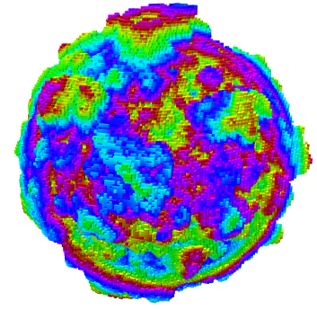
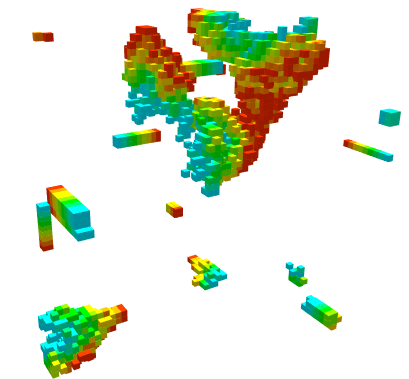
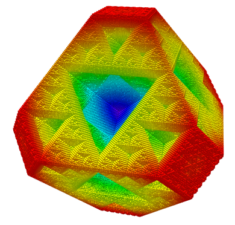
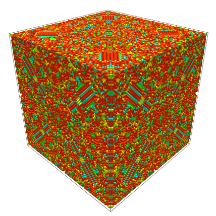
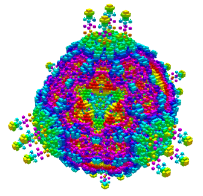

# 3D Cellular Automata
[Live Demo](http://fiendchain.github.io/3D-Cellular-Automata) of website here.

This is based on the youtube video by Softology. The article written by them can be found [here](https://softologyblog.wordpress.com/2019/12/28/3d-cellular-automata-3/), and their video linked below.

## Explanation
Cellular automata involves changing a collection of cells based on specific rules. Here we have a 3D grid of cells, and the rule is:
1. Depending on the number of surrounding cells it can either:
   - Resurrect a dead cell
   - Kill a living cell
   - Do nothing to the cell (dead or alive)
2. We can have intermediate states where the cell is dying. Here the cell is:
   - Unable to be resurrected
   - Unable to be killed
   - Continues to go from alive (255) to dead (0)
3. We can have different types of surrounding cells
   - Moore neighbourhood considers all surrounding 26 cells in 3D space
   - VonNeumann neighbourhood considers directly adjacent 6 cells in 3D space
Using these rules we can get interesting patterns.

A more detailed explanation can be found [here](https://softologyblog.wordpress.com/2019/12/28/3d-cellular-automata-3/) at Softology's article.

## Instructions
1. Press run to begin the simulation using the floating controls in the middle. 
2. You can pause, reset (clear), and randomise the simulation also using the floating controls.
3. In the rules panel you can change it to a different cellular automata rule by clicking on them. You can switch between different rules in realtime, however it can produce artifacts.
4. In the randomiser panel, you can change how the world is populated.
   - Seed crystal absolute places a blob in the middle with radius in blocks.
   - Seed crystal places a blob in the middle with radius as a fraction of maximum radius.
5. To change how the world is rendered, you can change the parameters in the graphics panel.
   - Renderer can be selected from volume, point, voxel
   - Volume is the fastest but worst quality 
   - Point is slower and has decent quality 
   - Voxel is the slowest and has the best quality (Very intensive)
   - To speed up the simulation, you can disable rendering (show render), and re-enable it later
6. To change the size of the world use the size controls panel. This will adjust the width, length and height of the simulation. (For large sizes this can become very intensive).

## Gallery

## Default rules
| | | |
|:---:|:---:|:---:|
| 445 | 678 678 | Amoeba |
|  |  |  |
| Builder 1 | Builder 2 | Clouds 1 |
|  |  |  |
| Crystal Growth 1 | Crystal Growth 2 | Pyroclastic |
|  |  |  |
| Slow Decay | Spikey Growth |
|  |  |

## Combining rules
You can also switch between the rules while it is running, which can create interesting patterns.
| | |
|:---:|:---:|
| Crystal Growth 1 to Crystal Growth 2 | 445 to Crystal Growth 1 |
|  |  |
