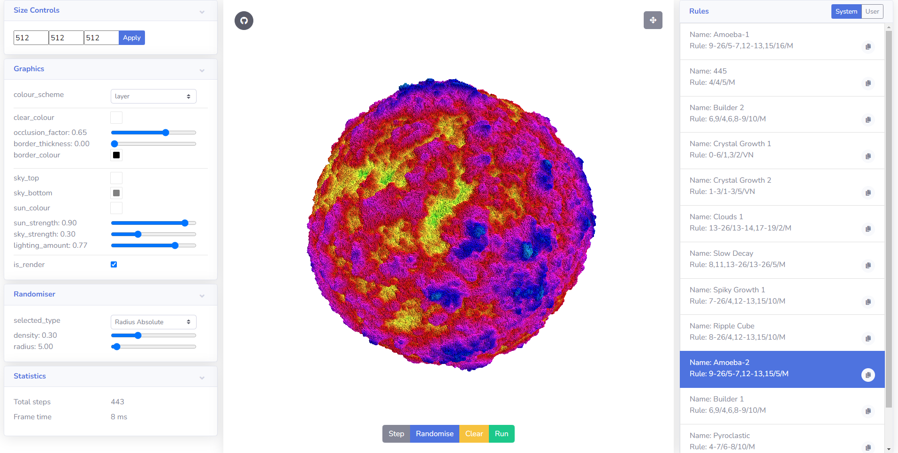
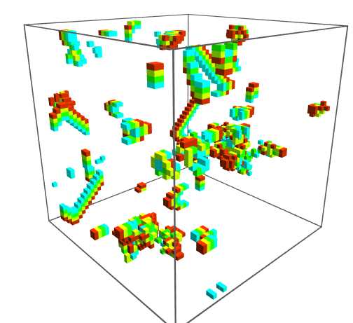
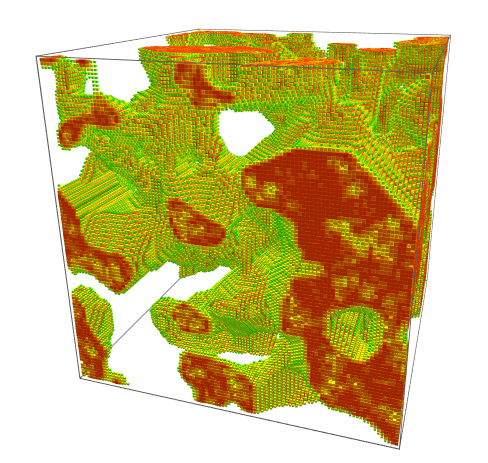
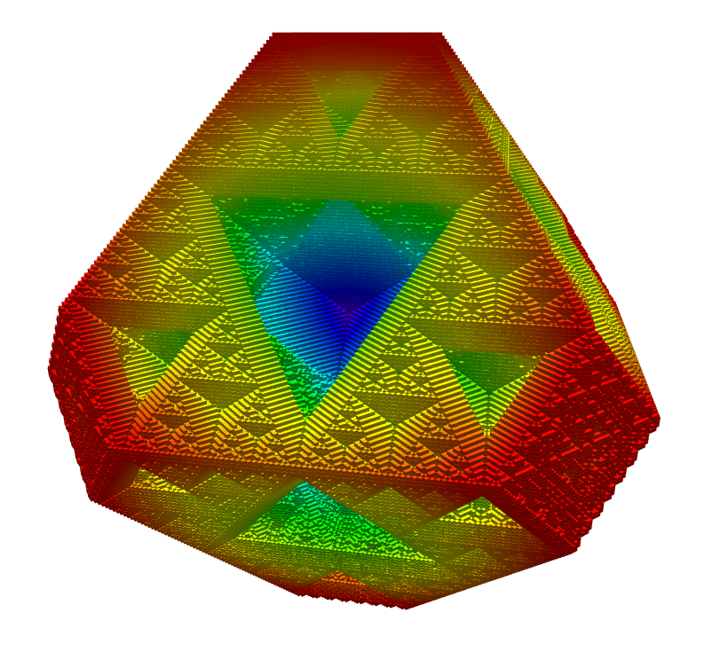
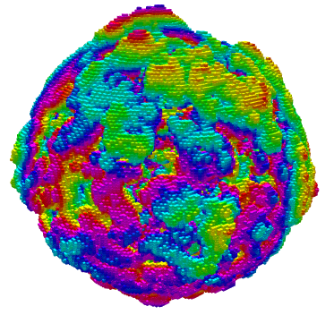
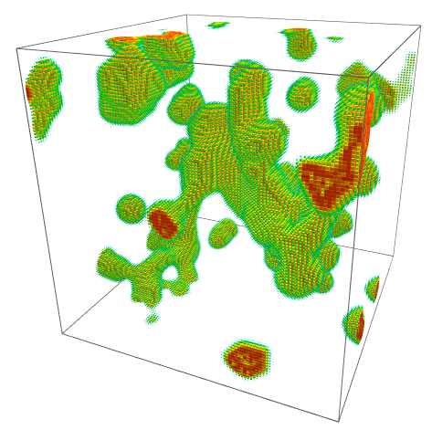
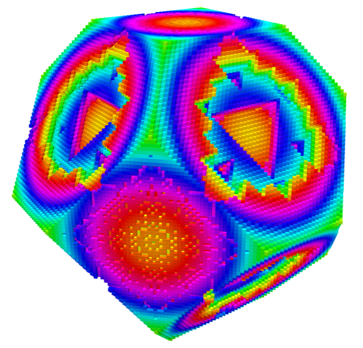
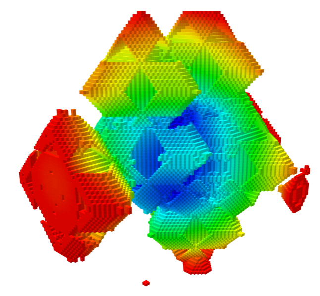

# 3D Cellular Automata

[Live Demo](http://williamyang98.github.io/3D-Cellular-Automata) of website here.

This is based on the youtube video by Softology. The article written by them can be found [here](https://softologyblog.wordpress.com/2019/12/28/3d-cellular-automata-3/), and their video linked below.

## Explanation
Cellular automata involves updating a 3D grid of cells based on specific rules.
1. Depending on the number of surrounding cells it can either:
   - Resurrect a dead cell
   - Kill a living cell
2. Cells which have died will decay in multiple steps from alive to dead called the refractory period. Here the cell is:
   - Unable to be resurrected
   - Unable to be killed
   - Gradually goes from alive (1.0) to dead (0.0) in increments
3. We can count the number of surrounding cells differently
   - Moore neighbourhood considers all surrounding 26 cells
   - Von Neumann neighbourhood considers the directly adjacent 6 cells 

Using these rules we can get interesting patterns.

A more detailed explanation can be found [here](https://softologyblog.wordpress.com/2019/12/28/3d-cellular-automata-3/) at Softology's article.

## Instructions
1. Press run to begin the simulation.
2. You can pause, reset, and randomise the simulation.
3. In the rules panel you can change it to a different cellular automata rule in realtime by clicking on them.
4. In the randomiser panel, you can change how the world is populated.
   - Radius absolute places a blob in the middle with radius in blocks.
   - Radius relative places a blob in the middle with radius as a fraction of maximum radius.
5. To change how the world is rendered you can change the parameters in the graphics panel.
   - You can select different colouring schemes.
   - Update the shader parameters in realtime.
   - To speed up the simulation you can disable rendering and re-enable it later.
6. Use the size controls panel to adjust the width, length and height of the simulation. 
   - For large sizes this can become very computationally and memory intensive.
   - For a 1024x1024x1024 with 1.07 billion cells it will use 4.29GB of VRAM.
   - VRAM usage = <code>4xyz</code> bytes. 
   - The volume data is stored in two 3D textures with red and green 1 byte channels.

The simulation is computed and rendered using webgl shaders. Therefore having a more powerful graphics card will enable higher simulation speeds.

## Gallery

## Default rules
| | | |
|:---:|:---:|:---:|
| 445 | 678 678 | Amoeba |
|  |  |  |
| Builder 1 | Builder 2 | Clouds 1 |
|  |  |  |
| Crystal Growth 1 | Crystal Growth 2 | Pyroclastic |
|  |  |  |
| Slow Decay | Spikey Growth |
|  |  |

## Combining rules
You can also switch between the rules while it is running, which can create interesting patterns.
| | |
|:---:|:---:|
| Crystal Growth 1 to Crystal Growth 2 | 445 to Crystal Growth 1 |
|  |  |

## Build instructions
1. Clone the repository and cd into it
2. <code>npm install</code>
3. <code>npm run start</code>